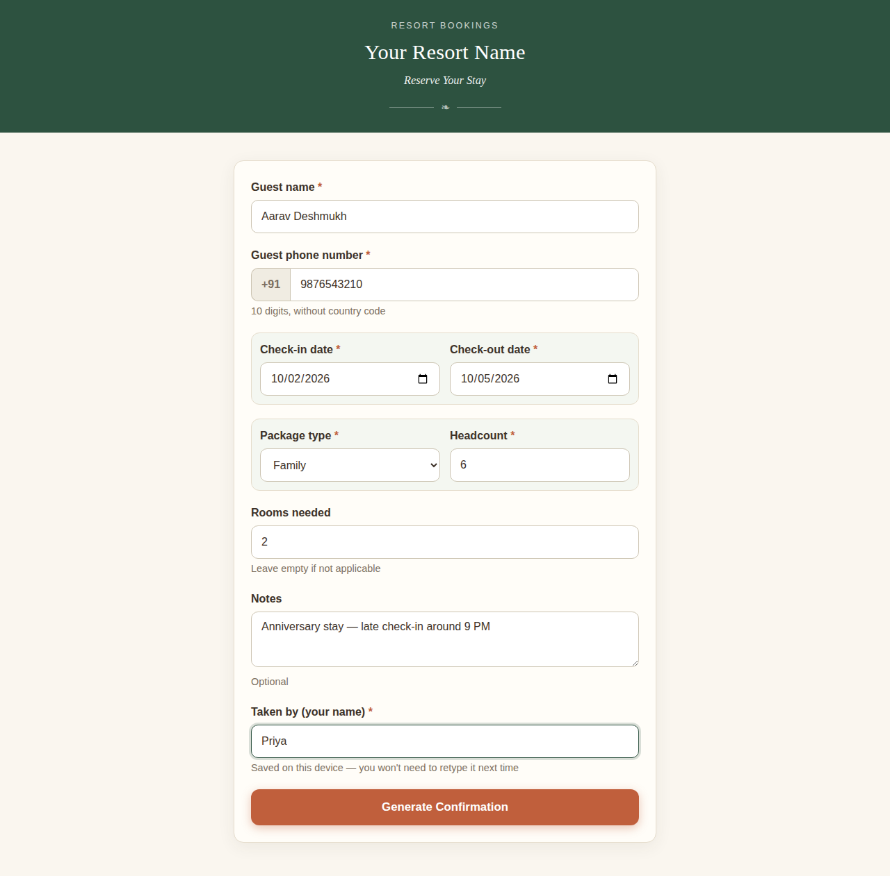
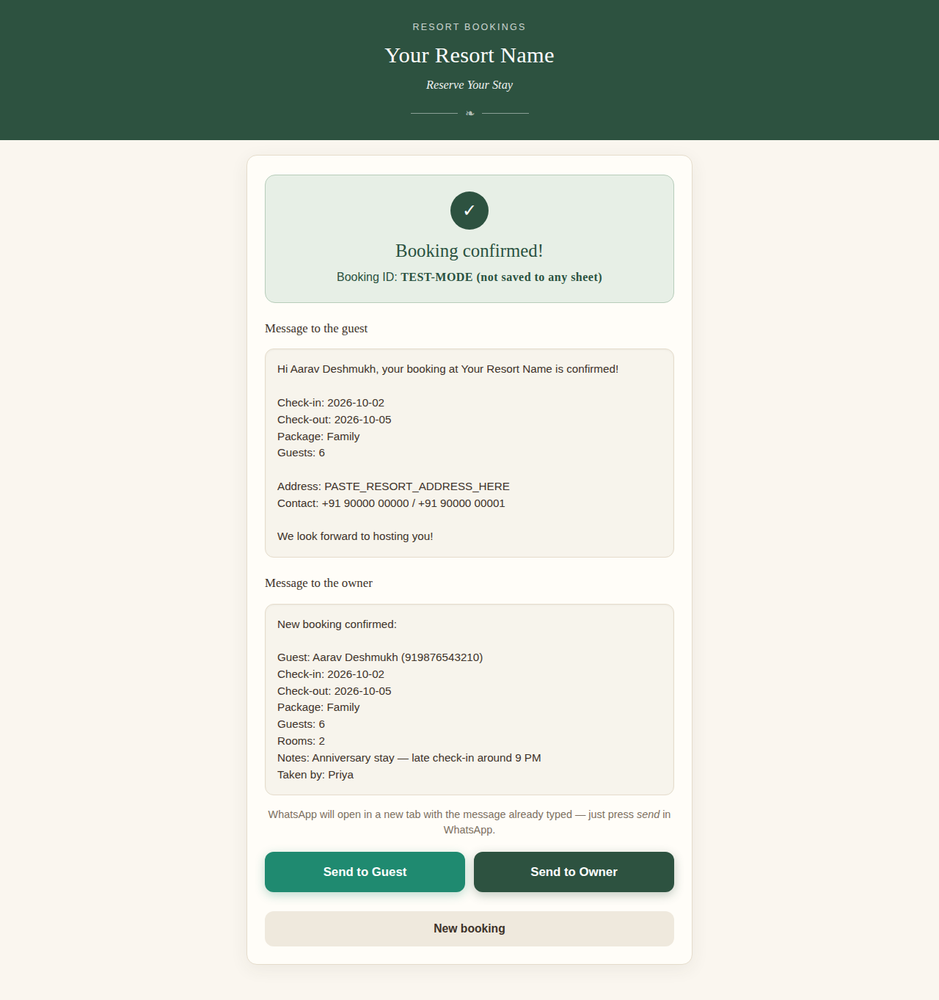

# Resort Booking Confirmation Tool

A zero-cost, zero-dependency web tool that digitizes phone bookings for a small
resort: a receptionist logs the booking once, it's saved to a Google Sheet as
the permanent record, and ready-to-send WhatsApp confirmations are generated
for the guest and the owner — no logins, no servers to manage, no recurring
cost.

Built for a real single-user deployment where the entire booking process was
previously paper-and-phone. The constraint stack (no budget, non-technical
maintainer, one receptionist) shaped every technical choice below.

## Screenshots

| Booking form | Confirmation panel |
|---|---|
|  |  |

*(Captured in test mode — the tool runs its full flow locally with no backend
when `APPS_SCRIPT_URL` is still the placeholder.)*

## How it works

```
  Receptionist                 Browser (static site)              Google
  ────────────                 ─────────────────────              ──────
      │ fills form ──────────► │                                   │
      │ presses Generate ────► │ inline validation                 │
      │                        │ POST booking (JSON, text/plain) ─►│ Apps Script
      │                        │                                   │ doPost()
      │                        │                                   │ appends row,
      │                        │        { success, booking_id } ───┤ generates ID
      │                        │ show previews + 2 buttons         │
      │ taps Send to Guest ──► │ wa.me/<guest>?text=<msg> ──► WhatsApp opens
      │ taps Send to Owner ──► │ wa.me/<owner>?text=<msg> ──► WhatsApp opens
```

The Google Sheet is the master record: one row per booking, append-only from
the website (edits/corrections happen directly in the Sheet).

## Features

- **Inline validation** — red messages under each field, nothing sent until
  every required field passes; check-out ≥ check-in enforced; phone normalized
  to a bare 10-digit field (country code added automatically).
- **Test mode** — with no backend configured, the tool still runs the entire
  flow (validation → previews → WhatsApp buttons) with a clearly-labelled test
  booking ID. Switches itself off the moment a real URL is pasted in.
- **Failure-safe form** — if the save fails (usually connectivity), the form
  stays filled; the button is simply pressed again.
- **Receptionist memory** — the operator's name persists via `localStorage`,
  so it's typed once per device.
- **Click-to-chat messaging** — `wa.me` deep links with `encodeURIComponent`-
  encoded message bodies; no WhatsApp Business API, no approval process, no cost.

## Tech stack

| Layer | Choice | Why |
|---|---|---|
| Frontend | Plain HTML + CSS + vanilla JS, no build step | Must be editable by a non-developer; deployable by dragging a folder onto Netlify |
| Hosting | Any static host (Vercel / Netlify / GitHub Pages) | It's three files |
| Backend | Google Apps Script Web App bound to the Sheet | Free, zero infrastructure, lives next to the data |
| Database | Google Sheets `Bookings` tab | The owner already lives in Sheets; the record is instantly familiar |
| Messaging | `wa.me` click-to-chat links | Free, no API keys, human confirms before sending |

## Design decisions

- **The CORS trick: `text/plain`, not `application/json`.** A JSON
  `Content-Type` makes the browser send a CORS pre-flight (`OPTIONS`) request
  that Apps Script's Web App endpoint cannot answer. Sending the JSON *text*
  with `Content-Type: text/plain;charset=utf-8` keeps the request "simple" —
  no pre-flight — and `Code.gs` parses the raw body itself.
- **Everything configurable lives in one block.** `APPS_SCRIPT_URL`,
  `OWNER_PHONE`, `RESORT_NAME`, `RESORT_ADDRESS`, `RESORT_CONTACT` sit at the
  very top of `script.js`. The page title and header are filled from
  `RESORT_NAME` at runtime, so re-branding is a one-line edit.
- **The deployment URL is the password.** The Apps Script is deployed as
  "anyone with the link can execute". For a single-user internal tool this is
  a deliberate trade-off (no auth stack to run or break) — anyone holding the
  URL can append rows. The URL is treated as a secret; see
  [ROADMAP.md](ROADMAP.md) for the upgrade path.
- **Append-only by design.** The website can only add rows. Corrections happen
  where the record lives — in the Sheet — so there's no edit/delete UI to get
  wrong.
- **Booking IDs encode the day.** `BK-YYYYMMDD-NNN` — generated server-side by
  counting today's rows — stays sortable and human-readable in the Sheet.

## Quick start

1. Open `index.html` in a browser. That's it — no server, no dependencies.
2. Fill the form and press **Generate Confirmation**. With
   `APPS_SCRIPT_URL` still set to the placeholder, the tool runs in **test
   mode**: the confirmation panel appears with a test booking ID and working
   WhatsApp buttons, and nothing is saved anywhere.

To go live, configure the backend:

1. Create a Google Sheet with a `Bookings` tab (or run `setUpSheet` once —
   see below).
2. **Extensions → Apps Script**, paste in `apps-script/Code.gs`.
3. Optionally run the `setUpSheet` function once — it creates the tab and
   headers if missing, and triggers Google's authorization prompt on your
   schedule rather than mid-booking.
4. **Deploy → New deployment → Web app** — Execute as: **Me**, access:
   **Anyone with the link**. Copy the URL.
5. Paste it into `APPS_SCRIPT_URL` at the top of `script.js`, set
   `OWNER_PHONE`, `RESORT_NAME`, `RESORT_ADDRESS` and `RESORT_CONTACT`.
6. Host the three root files anywhere static — Netlify drag-and-drop, a
   Vercel-imported repo, GitHub Pages.
7. End-to-end test: submit a booking, see the row in the Sheet, open both
   WhatsApp links, then delete the test row.

## Data model

One row per booking in the `Bookings` tab, fixed column order:

| Column | Notes |
|---|---|
| `booking_id` | `BK-YYYYMMDD-NNN`, generated server-side |
| `created_at` | `YYYY-MM-DD HH:mm` (script timezone) |
| `guest_name`, `guest_phone` | phone stored as `91` + 10 digits |
| `check_in_date`, `check_out_date` | ISO dates |
| `package_type` | Family / Group / Day Out |
| `headcount`, `rooms_needed` | rooms optional |
| `notes` | optional free text |
| `receptionist_name` | who took the call |
| `status` | defaults to `Confirmed` |

## Documentation

- [HANDOVER-GUIDE.md](HANDOVER-GUIDE.md) — plain-language guide for a
  non-technical maintainer (day-to-day use, common fixes, what to edit where).
- [ROADMAP.md](ROADMAP.md) — future improvements and infrastructure options
  as the tool outgrows the single-user, zero-cost constraints.

## License

[MIT](LICENSE)
